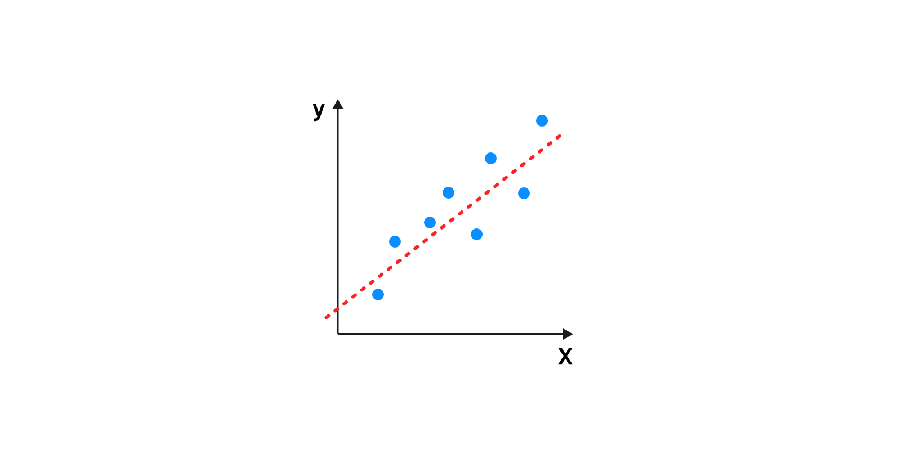
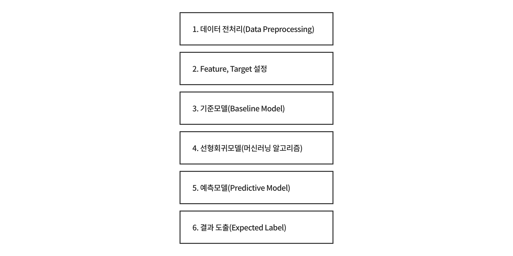

## 단순선형회귀분석 Simple Linear Regression Analysis


### 단순선형회귀분석 이란?

먼저 **선형회귀분석(Linear Regression Analysis)**는 <br>
독립변수와 종속변수가 **선형적인 관계(관련성)를 가지고 있다**는 전제하에,<br>
변수들간의 관계를 선형 함수식으로 모형화하기 위한 분석방법입니다.<br>

여기서 **1개의 종속변수에 독립변수 1개** 있을 때, **단순선형회귀분석**이라고 합니다.<br>
그러면 독립변수 2개 이상인 경우에는 다중선형회귀분석이라고 하죠







> 단순선형회귀분석을 위해 캐글에 있는 House Prices 데이터셋으로 공부했습니다.

## 주택 판매가격 예측해보기

다음과 같은 순서로


```python
## 모듈
import pandas as pd

## 데이터 불러오기
train_data = 'dataset/house_prices_train.csv'
test_data = 'dataset/house_prices_test.csv'

df = pd.read_csv(train_data)        # train 데이터프레임
df_test = pd.read_csv(test_data)    # test 데이터프레임
df.head()
```


<div>
<style scoped>
    .dataframe tbody tr th:only-of-type {
        vertical-align: middle;
    }

    .dataframe tbody tr th {
        vertical-align: top;
    }

    .dataframe thead th {
        text-align: right;
    }
</style>
<table border="1" class="dataframe">
  <thead>
    <tr style="text-align: right;">
      <th></th>
      <th>Id</th>
      <th>MSSubClass</th>
      <th>MSZoning</th>
      <th>LotFrontage</th>
      <th>LotArea</th>
      <th>Street</th>
      <th>Alley</th>
      <th>LotShape</th>
      <th>LandContour</th>
      <th>Utilities</th>
      <th>...</th>
      <th>PoolArea</th>
      <th>PoolQC</th>
      <th>Fence</th>
      <th>MiscFeature</th>
      <th>MiscVal</th>
      <th>MoSold</th>
      <th>YrSold</th>
      <th>SaleType</th>
      <th>SaleCondition</th>
      <th>SalePrice</th>
    </tr>
  </thead>
  <tbody>
    <tr>
      <th>0</th>
      <td>1</td>
      <td>60</td>
      <td>RL</td>
      <td>65.0</td>
      <td>8450</td>
      <td>Pave</td>
      <td>NaN</td>
      <td>Reg</td>
      <td>Lvl</td>
      <td>AllPub</td>
      <td>...</td>
      <td>0</td>
      <td>NaN</td>
      <td>NaN</td>
      <td>NaN</td>
      <td>0</td>
      <td>2</td>
      <td>2008</td>
      <td>WD</td>
      <td>Normal</td>
      <td>208500</td>
    </tr>
    <tr>
      <th>1</th>
      <td>2</td>
      <td>20</td>
      <td>RL</td>
      <td>80.0</td>
      <td>9600</td>
      <td>Pave</td>
      <td>NaN</td>
      <td>Reg</td>
      <td>Lvl</td>
      <td>AllPub</td>
      <td>...</td>
      <td>0</td>
      <td>NaN</td>
      <td>NaN</td>
      <td>NaN</td>
      <td>0</td>
      <td>5</td>
      <td>2007</td>
      <td>WD</td>
      <td>Normal</td>
      <td>181500</td>
    </tr>
    <tr>
      <th>2</th>
      <td>3</td>
      <td>60</td>
      <td>RL</td>
      <td>68.0</td>
      <td>11250</td>
      <td>Pave</td>
      <td>NaN</td>
      <td>IR1</td>
      <td>Lvl</td>
      <td>AllPub</td>
      <td>...</td>
      <td>0</td>
      <td>NaN</td>
      <td>NaN</td>
      <td>NaN</td>
      <td>0</td>
      <td>9</td>
      <td>2008</td>
      <td>WD</td>
      <td>Normal</td>
      <td>223500</td>
    </tr>
    <tr>
      <th>3</th>
      <td>4</td>
      <td>70</td>
      <td>RL</td>
      <td>60.0</td>
      <td>9550</td>
      <td>Pave</td>
      <td>NaN</td>
      <td>IR1</td>
      <td>Lvl</td>
      <td>AllPub</td>
      <td>...</td>
      <td>0</td>
      <td>NaN</td>
      <td>NaN</td>
      <td>NaN</td>
      <td>0</td>
      <td>2</td>
      <td>2006</td>
      <td>WD</td>
      <td>Abnorml</td>
      <td>140000</td>
    </tr>
    <tr>
      <th>4</th>
      <td>5</td>
      <td>60</td>
      <td>RL</td>
      <td>84.0</td>
      <td>14260</td>
      <td>Pave</td>
      <td>NaN</td>
      <td>IR1</td>
      <td>Lvl</td>
      <td>AllPub</td>
      <td>...</td>
      <td>0</td>
      <td>NaN</td>
      <td>NaN</td>
      <td>NaN</td>
      <td>0</td>
      <td>12</td>
      <td>2008</td>
      <td>WD</td>
      <td>Normal</td>
      <td>250000</td>
    </tr>
  </tbody>
</table>
<p>5 rows × 81 columns</p>
</div>


```python
## 필요한 column만 뽑아서 사용하기

df = df[['GrLivArea', 'LotArea', 'SalePrice']]
df_test = df_test[['GrLivArea', 'LotArea']]
# test에는 target을 넣으면 안되기 때문에 뺐음

## SalePrice 최소, 최대, 평균, 중앙값 계산하기

df['SalePrice'].min(), df['SalePrice'].max(), df['SalePrice'].mean(), df['SalePrice'].median()
# min():최소값  /  max():최대값  /  mean() : 평균값  /  median() : 중앙값
```


    (34900, 755000, 180921.19589041095, 163000.0)


```python
## describe로 확인해보기
df['SalePrice'].describe()
```


    count      1460.000000
    mean     180921.195890
    std       79442.502883
    min       34900.000000
    25%      129975.000000
    50%      163000.000000
    75%      214000.000000
    max      755000.000000
    Name: SalePrice, dtype: float64


```python
## 모듈
import matplotlib.pyplot as plt    # matplotlib : 시각화 모듈
import seaborn as sns              # seaborn : 시각화 모듈

# SalePrice 확률밀도함수 그리기
sns.displot(df['SalePrice'], kde=True);

# 평균(mean), 중간값(median) 수직선 그리기
plt.axvline(df['SalePrice'].mean(), color='blue');
plt.axvline(df['SalePrice'].median(), color='red');
```


    

    


가격을 처음으로 예측한다고 할 때, 가장 간단한 방법으로 평균(mean) 또는 중간값(median)을 이용하여 예측하는 방법도 있다


```python

```
